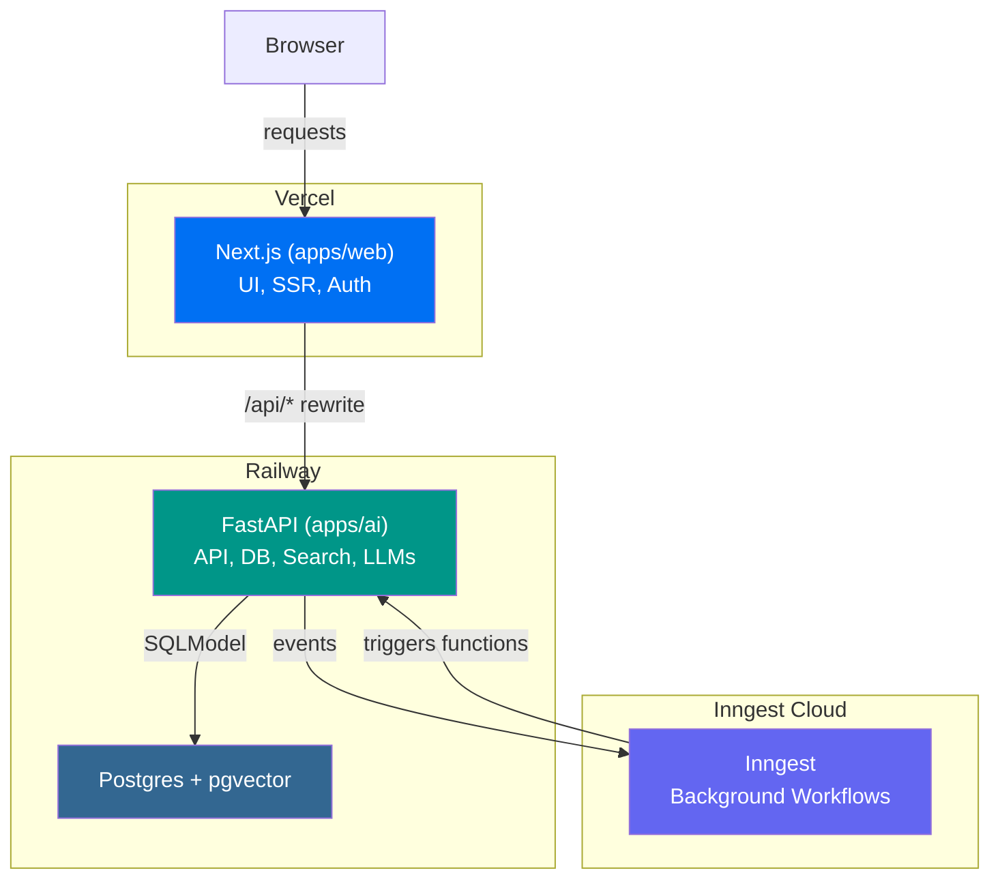
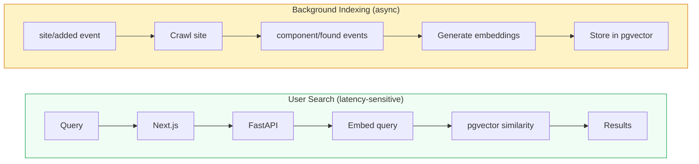

# Shadpedia

A site that collects and condenses amazing shadcn component websites, providing a way to semantically search across all these open-source components. It aims to be the ultimate resource for developers looking for shadcn components. It will have the components rendered on the page but will ultimately link to the original source. It will use AI to create descriptions and tags for each component and then a rag system to power the search.
## Sites like this ones

- [Triple D UI](https://ui.tripled.work/)
- [useLayouts](https://uselayouts.com/)
- [Vengence UI](https://www.vengenceui.com/)
- [Wigggle UI](https://wigggle-ui.vercel.app/)
- [Eldora UI](https://www.eldoraui.site/)


## Features

- **TypeScript** - For type safety and improved developer experience
- **Next.js** - Full-stack React framework
- **TailwindCSS** - Utility-first CSS for rapid UI development
- **Shared UI package** - shadcn/ui primitives live in `packages/ui`
- **Oxlint** - Oxlint + Oxfmt (linting & formatting)
- **PWA** - Progressive Web App support

## Getting Started

First, install the dependencies:

```bash
bun install
```

Then, run the development server:

```bash
bun run dev
```

Open [http://localhost:3001](http://localhost:3001) in your browser to see the fullstack application.

## UI Customization

React web apps in this stack share shadcn/ui primitives through `packages/ui`.

- Change design tokens and global styles in `packages/ui/src/styles/globals.css`
- Update shared primitives in `packages/ui/src/components/*`
- Adjust shadcn aliases or style config in `packages/ui/components.json` and `apps/web/components.json`

### Add more shared components

Run this from the project root to add more primitives to the shared UI package:

```bash
npx shadcn@latest add accordion dialog popover sheet table -c packages/ui
```

Import shared components like this:

```tsx
import { Button } from "@my-better-t-app/ui/components/button";
```

### Add app-specific blocks

If you want to add app-specific blocks instead of shared primitives, run the shadcn CLI from `apps/web`.

## Git Hooks and Formatting

- Format and lint fix: `bun run check`

## Architecture



### Data Flow

The app processes data through two distinct flows:

**Search (latency-sensitive)**: User query → Next.js → FastAPI → query embedding → pgvector similarity search → results returned instantly

**Ingest (background)**: `site/added` event → crawl site  → emit `component/found` events → generate descriptions using batch LLM calls → generate embeddings → store in pgvector for search



## Project Structure

```
shadpedia/
├── apps/
│   ├── web/         # Next.js — UI, SSR, auth (Vercel)
│   └── ai/          # FastAPI — API, DB, search, LLMs (Railway)
├── packages/
│   ├── ui/          # Shared shadcn/ui components and styles
│   ├── config/      # Shared TypeScript config
│   └── env/         # Shared env validation
```

## Available Scripts

- `bun run dev`: Start all applications in development mode
- `bun run build`: Build all applications
- `bun run dev:web`: Start only the web application
- `bun run check-types`: Check TypeScript types across all apps
- `bun run check`: Run Oxlint and Oxfmt
- `cd apps/web && bun run generate-pwa-assets`: Generate PWA assets
