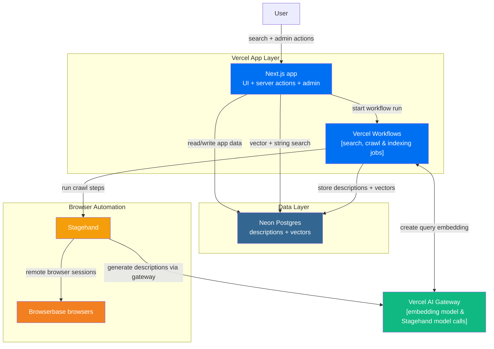
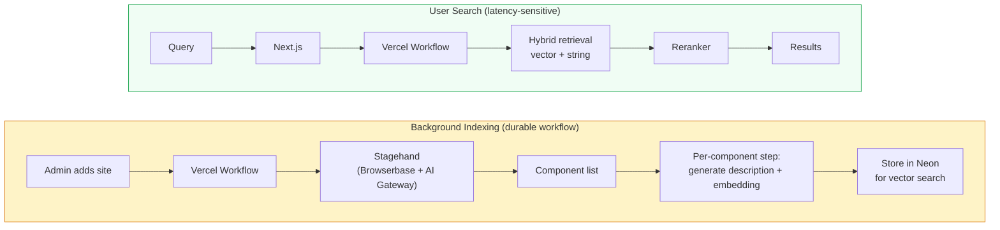

# Shadpedia

A way to easily search for amazing shadcn components.

Usally when I am building my frontend code I often find myself looking for shadcn components from sites below. It is a very time consuming process to find the right component, broswing through these sites. This project aims to solve that by providing a centralized search interface and previews of the components. 

### Sites like this ones

- [Triple D UI](https://ui.tripled.work/)
- [useLayouts](https://uselayouts.com/)
- [Vengence UI](https://www.vengenceui.com/)
- [Wigggle UI](https://wigggle-ui.vercel.app/)
- [Eldora UI](https://www.eldoraui.site/)


## Architecture
Next.js server actions + Vercel Workflows handle all logic. The crawler runs through Stagehand on Browserbase, with model calls routed through Vercel AI Gateway.



### Data Flow

Two distinct paths: a hot search path and a durable background workflow pipeline.

**Search (latency-sensitive)**: User query → Next.js triggers a Vercel Workflow → AI Gateway creates the query embedding → Neon runs hybrid retrieval (vector search + string search) → reranker → ranked results.

**Workflows (durable background)**: Admin submits site in admin panel → Vercel Workflow starts → step 1 runs Stagehand on Browserbase, with its model calls routed through AI Gateway, to discover component URLs → one durable step per component fetches the component, has Stagehand generate a description, creates an embedding, and stores both in Neon for vector search. Each step is independently retriable and can resume cleanly if a browser task fails mid-crawl.



## Project Structure

```
shadpedia/
├── apps/
│   ├── web/         # Next.js — UI, SSR, auth (Vercel)
├── packages/
│   ├── ui/          # Shared shadcn/ui components and styles
│   ├── config/      # Shared TypeScript config
│   └── env/         # Shared env validation
```


## Getting Started

First, install the dependencies:

```bash
bun install
```

Then, run the development server:

```bash
cd apps/web
&& bun run dev
```
